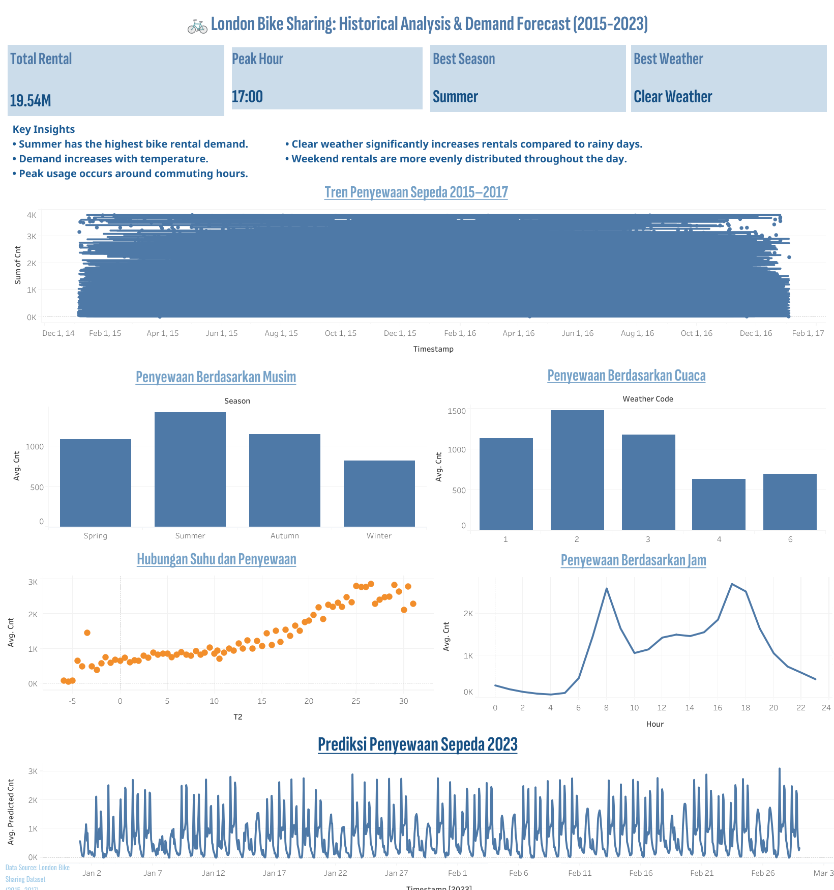

# 🚲 London Bike Sharing Demand Analysis and Forecasting

## 📌 Project Overview

This project analyzes bike-sharing demand in London and builds a machine learning model to forecast future rental demand based on weather conditions and temporal features.

The project combines:

- Exploratory Data Analysis (EDA)
- Feature Engineering
- Machine Learning Modeling
- Demand Forecasting
- Interactive Tableau Dashboard

The goal is to understand the factors affecting bike rental demand and provide demand forecasts that can support transportation planning and operational decision-making.

---

## 📊 Dashboard Preview

🔗 Interactive Tableau Dashboard:

https://public.tableau.com/app/profile/silvy.putri.hanafi/viz/LondonBikeSharingDashboard_17809844480910/Dashboard2

---

## 🎯 Business Problem

Bike-sharing operators need accurate demand forecasting to:

- Optimize bike allocation
- Reduce shortages during peak demand
- Improve customer satisfaction
- Support sustainable transportation planning

Understanding rental patterns can help operators make better operational decisions and improve service availability.

---

## 📦 Dataset

Source:

https://www.kaggle.com/datasets/hmavrodiev/london-bike-sharing-dataset

The dataset contains approximately 17,414 hourly records collected between 2015 and 2017.

### Features

| Feature | Description |
|----------|----------|
| timestamp | Observation timestamp |
| cnt | Total bike rentals |
| t1 | Actual temperature |
| t2 | Feels-like temperature |
| hum | Humidity |
| wind_speed | Wind speed |
| weather_code | Weather condition |
| is_holiday | Holiday indicator |
| is_weekend | Weekend indicator |
| season | Season category |

---

## 🔍 Exploratory Data Analysis

Key findings from the analysis:

### 🌞 Seasonal Pattern

Summer shows the highest average bike rental demand, while Winter records the lowest.

### 🌡 Temperature Effect

Bike rental demand increases as temperature rises.

### 🕒 Peak Usage Hours

Demand peaks around:

- 08:00
- 17:00–18:00

indicating strong commuting behavior.

### ☁ Weather Impact

Weather conditions significantly influence rental volume.

Clear and partly cloudy conditions generate higher rental demand compared to rainy or snowy conditions.

---

## ⚙ Data Preprocessing

The following preprocessing steps were applied:

- Missing value checking
- Duplicate checking
- Outlier handling using IQR method
- Datetime feature extraction
- Feature scaling using StandardScaler
- Multicollinearity analysis using VIF

Feature engineering generated:

- Year
- Month
- Day
- Hour

from the timestamp variable.

---

## 🤖 Machine Learning Models

Several regression algorithms were evaluated:

- Linear Regression
- Ridge Regression
- Lasso Regression
- Random Forest Regressor
- Gradient Boosting Regressor
- AdaBoost Regressor
- LightGBM Regressor
- XGBoost Regressor
- K-Nearest Neighbors Regressor

Hyperparameter tuning was performed using GridSearchCV.

---

## 🏆 Best Model

Best-performing model:

**XGBoost Regressor**

Performance Metrics:

| Metric | Value |
|----------|----------|
| R² Score | 0.949572 |
| RMSE | 231.317537 |
| MAE | 143.588785 |

---

## 📈 Feature Importance

Top influential features:

1. Hour
2. Temperature (T2)
3. Weather Code
4. Humidity
5. Season

These variables contribute the most to rental demand prediction.

---

## 🔮 Forecasting

The trained model was used to predict bike-sharing demand for January–February 2023 using real weather data retrieved from the Open-Meteo API.

Forecast results indicate demand patterns similar to historical observations.

---

## 🛠 Technologies Used

### Programming

- Python

### Libraries

- Pandas
- NumPy
- Matplotlib
- Seaborn
- Scikit-Learn
- XGBoost
- LightGBM

### Visualization

- Tableau Public

### Environment

- Google Colab

---

## 📁 Repository Contents

| Folder | Description |
|----------|----------|
| data | Historical and forecast datasets |
| notebooks | Analysis and modeling notebook |
| dashboard | Tableau dashboard screenshots |
| model | Saved trained models |

---

## 👩‍💻 Author

**Silvy Putri Hanafi**
